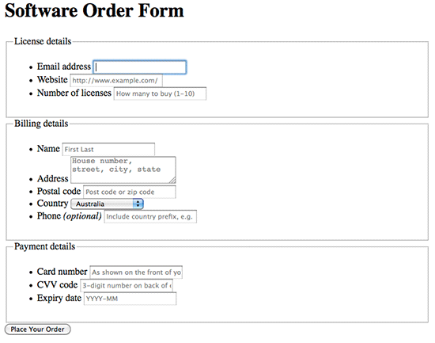
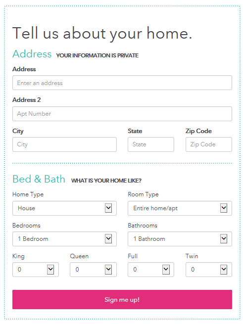

# CSS/HTML Forms Lab
 
### Intro

In a web development role, you might find yourself asked to perform multiple roles - such as implementation AND basic design of a web page. In cases like these, its important to be able to mock up simple interfaces that match current design standards - whether or not they're perfectly designed or not. 

Even if you don't consider yourself "artistically inclined", its important to be able to mimic basic design patterns seen in modern websites. This way, clients/users testing your code have some idea what to expect from their interaction with your work. Otherwise, your client might take bad design to mean "bad code".

For instance - 

#### Bad/confusing/offputting:

#### Good/understandable/pleasant:

### Description

A client has approached you to make an online madlib-style game for them. They're most concerned with the JS functionality, but their designer is sick - so they need you to make the front end look decent enough to present the page to a board member until the final design can be hashed out. 

They've given you the basic framework, with pseudo-code detailing how they want the CSS and JS to work - get this JS working, then make sure the page follows the basic CSS guidelines. The result should be a pretty standard looking form - no designer required!

The design the client is asking for is loosely based on [Bootstrap's Form CSS](https://v4-alpha.getbootstrap.com/components/forms/). Feel Free to use this as a visual guide for "best practice". 

Still stumped? The end result should look something like this . . .

	

### Technical Requirements

- Fill in the JS pseudo-code so that the form works
- Style the form elements according to the descriptions in the CSS file so that it looks nice
- On submit, the form should render the information from the form on the page

### BONUS!

Your client asked you for a pretty bare-bones form - can you make it better? What CSS or JS tricks can you add to it to make the form really pop? If you've already accomplished what the client has asked for, go ahead and copy the code you have into a second directory and experiment with some design tweaks. You can use [Google's Material Design guide](https://material.google.com/components/text-fields.html) as a reference point.
